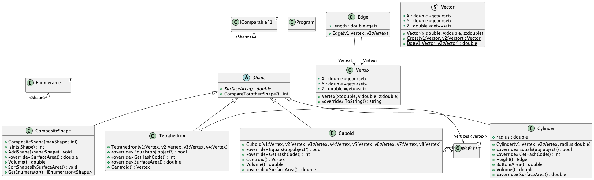

### Markdown Preview
To preview the Markdown file, press Ctrl + Shift + V (or Cmd + Shift + V on macOS).

# Assignment1 Report

Course: C# Development SS2025 (4 ECTS, 3 SWS)

Student ID: 2310866008

BCC Group: Group B

Name: Alikhan Manat

## Methodology: 
1. **Base Class (`Shape`)**:  
   - A base abstract class `Shape` was created to define the common properties and methods for all shapes.  
   - It includes abstract methods like `SurfaceArea()` and `Volume()` to ensure that all derived classes implement these calculations.

2. **Derived Classes**:  
   - **`Tetrahedron`**: Represents a 3D triangular pyramid. It calculates the surface area using the areas of its triangular faces.  
   - **`Cuboid`**: Represents a rectangular prism. It calculates the surface area and volume using its length, width, and height.  
   - **`Cylinder`**: Represents a cylindrical shape. It calculates the surface area and volume using its radius and height.  

3. **Composite Shape (`CompositeShape`)**:  
   - A `CompositeShape` class was implemented to combine multiple shapes into a single entity.  
   - It stores shapes in a `List<Shape>` and provides methods to calculate the combined surface area and volume of all shapes in the composite.  
   - It also supports sorting shapes by surface area using the `IComparable` interface.

4. **Operator Overloading**:  
   - The `+` operator was overloaded to allow adding shapes to a `CompositeShape`.  
   - The `[]` operator was overloaded to access shapes in a `CompositeShape` by index.  
   - The `==` operator was overloaded to compare two shapes for equality. This checks if the shapes are of the same type and have identical properties (e.g., dimensions, vertices, etc.).

5. **Sorting and Searching**:  
   - Shapes in a `CompositeShape` can be sorted by their surface area using the `SortShapesBySurfaceArea()` method.  
   - The sorting functionality leverages the `IComparable` interface, which was implemented in the `Shape` class to compare shapes based on their surface area.  
   - The `IsIn()` method was implemented to check if a specific shape exists in the composite and return its index.
6. **Vertices and Edges**:  
   - All shapes are defined using **vertices** (points in 3D space) and, where applicable, **edges** (connections between vertices).  
   - These vertices and edges are used to calculate geometric properties such as surface area, volume, and centroid.  
   - For example:
     - A `Cuboid` is defined by 8 vertices and 12 edges.
     - A `Tetrahedron` is defined by 4 vertices and 6 edges.
     - A `Cylinder` is defined by 2 vertices (centers of the circular bases) and its height (edge).

## Discussion/Conclusion
1. **Choosing the Data Structure for Vertices**:
The first minor challenge I faced was finding the best way to store vertices. There are several options, such as Stacks, Queues, Dictionaries, and Lists. I chose to use a List because it's simple and optimal.
2. **Operator Overloading**:
Overloading operators like `+`, `[]`, and `==` was a new concept for me. It required careful consideration to ensure the operators behaved intuitively and aligned with the project's requirements. 
3. **Using IComparable for Sorting**:
I found `IComparable` difficult to use because I had never used it in practice before, but I understood its purpose. After researching and experimenting, I implemented the `CompareTo` method in the `Shape` class to compare shapes based on their surface area.

## Class Diagram

Below is the class diagram for the project:

## Reference: 
- **IComparable**: https://learn.microsoft.com/en-us/dotnet/api/system.icomparable-1?view=net-9.0
- **IEnumerable**: https://learn.microsoft.com/en-us/dotnet/api/system.collections.ienumerable?view=net-9.0
- **Operator Overloading**: https://learn.microsoft.com/en-us/dotnet/csharp/language-reference/operators/operator-overloading